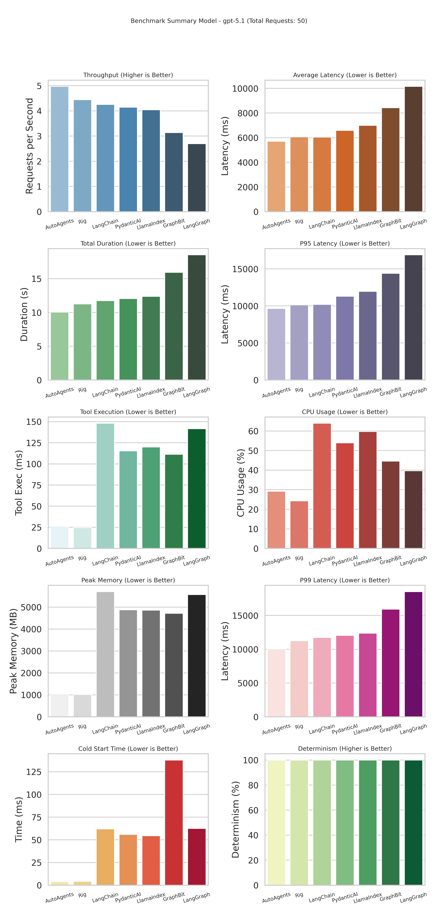

## AutoAgents Benchmark

Concurrent completion benchmarks for the `autoagents` framework alongside GraphBit, LangChain, LangGraph, CrewAI, PydanticAI, Rig (Rust) and LlamaIndex agents.

All runners read their workload settings from `benchmark.yaml` (or a path provided via `BENCH_CONFIG`). Update that file to change request count, concurrency, model, or prompt template once and share it across languages.

All runners require an `OPENAI_API_KEY` that can call the configured models.
The benchmark suite runs in two modes:
- **Tool mode**: agents call the trip-data tool.
- **LLM-only mode**: the average is precomputed and the model only formats the answer.

Results are written to:
- `benchmark_results_tool.json`
- `benchmark_results_llm.json`

### Disclaimer
The benchmarks are written in Rust and Python. The Rust benchmarks use the `autoagents` framework, while the Python benchmarks use GraphBit, LangChain, LangGraph, CrewAI, PydanticAI, Rig, and LlamaIndex. The benchmarks measure execution speed, CPU usage, memory footprint, and determinism. If you feel like the benchmarks are not accurate or you have any suggestions, please feel free to open an issue or submit a pull request.

---

### Benchmark
The below bencmark is run for 50 concurrent requests to process an ReAct Style Agent to process and parquet file to calculate the average duration time.



---

### Rust benchmark (AutoAgents)

```shell
export OPENAI_API_KEY=sk-your-key

cargo run --release -- autoagents
cargo run --release -- rig
```

### Python benchmark (GraphBit, LangChain, LangGraph, CrewAI, PydanticAI, LlamaIndex)

```shell
export OPENAI_API_KEY=sk-your-key

# Using uv (recommended) or your preferred Python runner
uv run main.py pydantic --model tool

cargo run --release -- all
```

### Plotting

```shell
uv run python plot_benchmarks.py --input benchmark_results_tool.json
uv run python plot_benchmarks.py --input benchmark_results_llm.json
```

### Web Dashboard
For web based UI to look into, check out `benchmark-dashboard`.

### Note

Python Files are in `_src` folder and Rust in `src`
